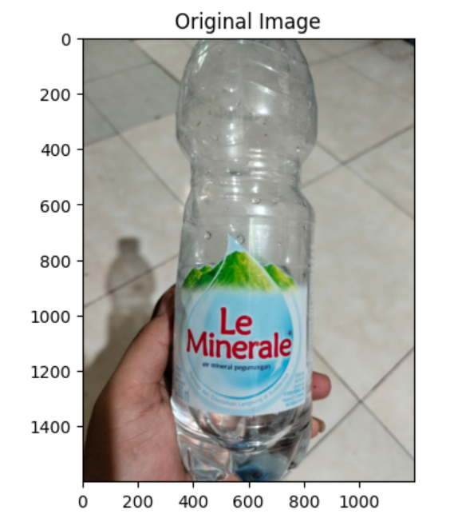
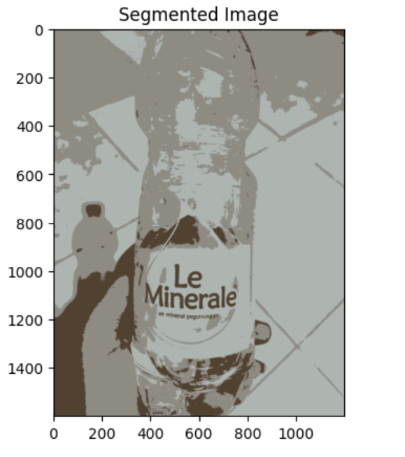

# UAS4-Pengolahan-Citra

| NO  | NAMA            | NIM       | KELAS     | MATA KULIAH      |
| --- | -----------     | --------- | --------- | ---------------- |
| 1   | Taufik Hidayat  | 312210674 | TI.22.B.2 | Pengolahan Citra |

# Segementasi Gambar Citra Digital Dengan Algoritma K-means Clustering

```
  import cv2
  import numpy as np
  import matplotlib.pyplot as plt

  # Muat gambar
  image_path = 'botol.jpeg'
  image = cv2.imread(image_path)

  # Periksa apakah gambar berhasil dimuat
  if image is None:
      raise ValueError(f"Image not found at the path: {image_path}")

  # Konversi gambar ke RGB
  image = cv2.cvtColor(image, cv2.COLOR_BGR2RGB)

  # Tampilkan gambar asli
  plt.imshow(image)
  plt.title('Original Image')
  plt.show()

  # Ubah bentuk gambar menjadi vektor fitur (n_samples, n_features)
  pixel_values = image.reshape((-1, 3))
  pixel_values = np.float32(pixel_values)

  # Parameter K-Means
  k = 3  # jumlah cluster
  max_iter = 100  # jumlah iterasi maksimum

  # K-Means algoritma
  def initialize_centroids(pixel_values, k):
      np.random.seed(42)
      random_indices = np.random.choice(len(pixel_values), size=k, replace=False)
      centroids = pixel_values[random_indices]
      return centroids

  def compute_distances(pixel_values, centroids):
      distances = np.linalg.norm(pixel_values[:, np.newaxis] - centroids, axis=2)
      return distances

  def assign_clusters(distances):
      return np.argmin(distances, axis=1)

  def compute_centroids(pixel_values, labels, k):
      centroids = np.zeros((k, pixel_values.shape[1]))
      for i in range(k):
          centroids[i] = np.mean(pixel_values[labels == i], axis=0)
      return centroids

  def kmeans(pixel_values, k, max_iter):
      centroids = initialize_centroids(pixel_values, k)
      for i in range(max_iter):
          distances = compute_distances(pixel_values, centroids)
          labels = assign_clusters(distances)
          new_centroids = compute_centroids(pixel_values, labels, k)
          if np.all(centroids == new_centroids):
              break
          centroids = new_centroids
      return centroids, labels

  # Jalankan K-Means
  centroids, labels = kmeans(pixel_values, k, max_iter)

  # Ubah label menjadi gambar
  segmented_image = centroids[labels].reshape(image.shape).astype(np.uint8)

  # Tampilkan gambar hasil segmentasi
  plt.imshow(segmented_image)
  plt.title('Segmented Image')
  plt.show()
```

# Output




